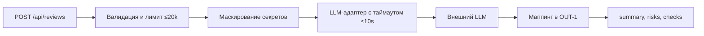

# ADR: решение для первого рабочего сценария

- Статус: proposed / accepted
- Дата: 2026-09-11
- Ответственные: Команда API, владелец продукта

## Контекст

Эндпоинт POST /api/reviews передаёт diff в внешний LLM через ReviewService без валидации, ограничений и обработки ошибок (см. TRAINING_PR.diff). Требуется соответствие правилам SEC-1, API-1, REL-1, OUT-1.

## Решение

Ввести контракт входа/выхода (OUT-1), фильтрацию секретов (SEC-1), ограничение длины diff и возврат 413 (API-1), таймаут вызова LLM 10s и контролируемые ошибки (REL-1). Архитектурно: слой валидации и санитайза перед вызовом LLM; адаптер LLM с таймаутом и маппингом ошибок.

## Рассмотренные альтернативы

| Альтернатива | Почему не выбрали сейчас |
|---|---|
| Делегировать всё логике клиента | Нет контроля и несоответствие правилам репозитория |

## Последствия и главный риск

- Положительные последствия:
  Повышение надёжности и предсказуемости ответов; соблюдение правил SEC-1, API-1, REL-1, OUT-1
- Ограничения:
  Возможна усечённость контекста diff; дополнительная задержка на санитайзинг
- Главный риск:
  Ложноположительное скрытие «секретов», ухудшающее качество ревью
- Как проверим риск:
  Тест с синтетическим diff, содержащим паттерны секретов; убедиться, что [REDACTED] не мешает смыслу ревью

## Архитектурная схема

## Как использовали AI

- Для чего: Зафиксировать архитектурное решение под правила репозитория
- Тип промпта: master prompt
- Строка в [`prompts.md`](prompts.md): P1-02
- Что проверили и исправили сами: Согласовали блоки решения с SEC-1, API-1, REL-1, OUT-1
