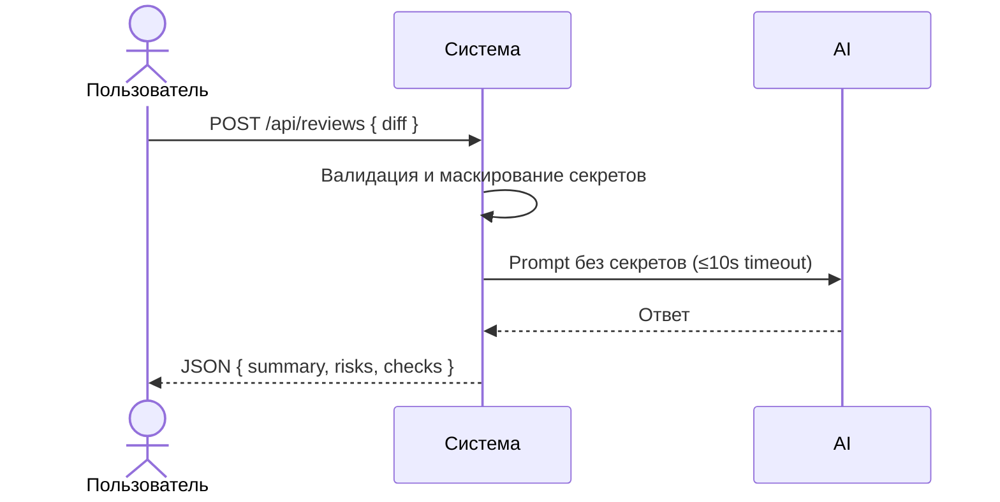

# Use cases и user stories

## Первый рабочий сценарий

**Когда** клиент отправляет diff PR на ревью, **система** валидирует и очищает вход, передаёт его в LLM с таймаутом и возвращает структурированный ответ, **а пользователь получает** summary, до три risks и список checks по контракту.

Не входит в этот сценарий:

- Интеграция с репозиториями и авто-комментарии в PR
- Улучшение качества генерации за пределами фильтрации и формата ответа
- Авторизация и биллинг

## Use case

| Поле | Значение |
|---|---|
| Актор | Клиент API |
| Триггер | POST /api/reviews с JSON { diff } |
| Предусловия | Сервис доступен; diff ≤ 20 000 символов |
| Основной результат | Ответ JSON с summary, risks (≤3), checks |
| Ошибка или отказ | 422 при отсутствии/невалидном diff; 413 при превышении длины; контролируемый 5xx при ошибке LLM |



## User stories и acceptance criteria

```gherkin
Feature:

  Scenario: Позитивный
    Given корректный JSON с diff длиной ≤ 20k
    When отправляю POST /api/reviews
    Then получаю 200 и тело с полями summary, risks (≤3 элементов с file, line, evidence, risk), checks (массив)

  Scenario: Негативный или граничный
    Given JSON без поля diff
    When отправляю POST /api/reviews
    Then получаю 422 с описанием ошибки валидации

  Scenario: Превышение длины
    Given diff длиной > 20000 символов
    When отправляю POST /api/reviews
    Then получаю 413 Request Entity Too Large
```

## Как использовали AI

- Для чего: Сформировать минимальный ценный сценарий и критерии приёмки
- Тип промпта: master prompt
- Строка в [`prompts.md`](prompts.md): P1-02
- Что проверили и исправили сами: Уточнили негативные и граничные сценарии в привязке к API-1/OUT-1/REL-1
