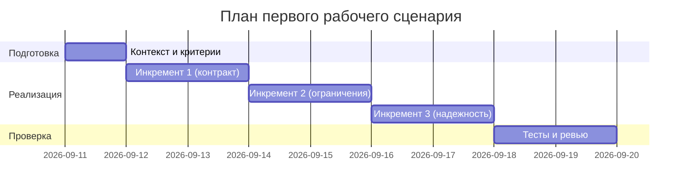

# План поставки

## Инкременты и ответственность

| Инкремент | Наблюдаемый результат | Что делает человек | Что делает AI или субагент | Проверка | Зависимости |
|---|---|---|---|---|---|
| 1 | Валидный контракт входа/выхода | Определяет схемы и коды | Формирует структурированный ответ (OUT-1) | Интеграционные тесты FastAPI | — |
| 2 | Защита и ограничения | Настраивает лимит длины и политику 413 | Маскирует секреты (SEC-1) | Юнит/интеграционные тесты | Инкремент 1 |
| 3 | Надежность LLM | Определяет таймаут/ретраи | Выполняет вызов с таймаутом и маппинг ошибок (REL-1) | Тесты отказов | Инкременты 1-2 |

## Exit Criteria по инкрементам

| Инкремент | Тестовые сьюты должны быть зелёные | Правила/контракты | Дополнительно |
|---|---|---|---|
| 1 | Unit (сбор ответа), Integration (валидация входа/выхода), E2E (успех/422/413) | OUT-1 (структура ответа), API-1 (лимит), вход: diff — строка | Обновлены схемы/документация API |
| 2 | Unit (санитайзинг, лог-хелпер), Integration/E2E (OBS-1 проверки логов) | SEC-1 (маскирование), OBS-1 (политика логирования) | Отсутствуют утечки diff/prompt/response в логах |
| 3 | Unit (таймаут/ретраи/классификация), Integration/E2E (504/502/500), Load (stress) | REL-1 (таймаут 10s, маппинг ошибок), ретраи x3 с jitter | Среднее число попыток ≤3; стабильный p95 успешных ответов |

## Definition of Done (поставка)

- Пройдены Unit/Integration/E2E/Load согласно Exit Criteria инкрементов
- ADR (adr.md) соответствует реализованному поведению (OUT-1/API-1/REL-1/OBS-1)
- Логи соответствуют OBS-1; автоматические проверки не находят утечек
- В master prompt и prompts.md отражены обновления и evidence
- Нет открытых критических дефектов, влияющих на первый рабочий сценарий

## RACI / ответственность

| Активность | Архитектор | Backend | QA | AI-инженер | SRE/DevOps | Product |
|---|---|---|---|---|---|---|
| ADR и маппинг ошибок | R | C | C | A | I | I |
| Контракты API/валидация | C | A | C | I | I | I |
| Санитайзинг (SEC-1) | C | A | C | R | I | I |
| Политика логов (OBS-1) | C | A | C | I | R | I |
| Адаптер LLM (таймаут/ретраи) | C | C | C | A | R | I |
| Тесты unit/integration/e2e | C | C | A | C | I | I |
| Нагрузочные проверки | C | C | C | C | A | I |

Легенда: A — accountable, R — responsible, C — consulted, I — informed

## Риски и меры

| Риск | Влияние | Мера снижения | Проверка |
|---|---|---|---|
| Таймаут LLM >10s | Зависания, деградация | Таймаут 10s, 504 | Интеграция/E2E (504), Load stress |
| Взрыв ретраев | Рост нагрузки, задержки | Cap x3, jitter | Unit (счётчик), Load (≤3 попыток) |
| Утечки в логах | Комплаенс/безопасность | OBS-1, лог-хелпер | Unit/Integration/E2E лог-сканы |
| Нарушение OUT-1 | Интеграции ломаются | Сбор ответа, валидаторы | Unit/E2E структура ответа |

## Откат и Feature Flags

- Флаг ретраев (вкл/выкл) при всплесках отказов LLM
- Флаг строгой валидации входа для быстрого реагирования на инциденты
- Переключение на локальную заглушку LLM для изоляции инцидентов

## Контрольные точки (Gates)

- Gate A: ADR accepted (архитектор/продакт согласовали)
- Gate B: Unit/Integration зелёные по инкрементам 1–2
- Gate C: E2E зелёные, OBS-1 подтверждён
- Gate D: Load SLO подтверждены; ретраи ≤x3; нет утечек

## Диаграмма Ганта

## Как использовали AI

- Для чего: Разбить работу на инкременты и определить проверки
- Тип промпта: master prompt
- Строка в [`prompts.md`](prompts.md): P1-02
- Что проверили и исправили сами: Согласовали инкременты с правилами SEC-1, API-1, REL-1, OUT-1
