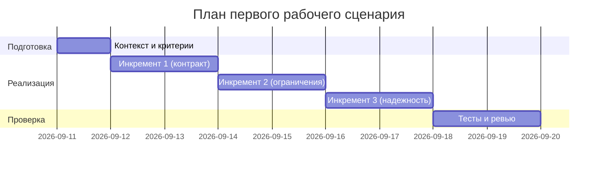

# План поставки

## Инкременты и ответственность

| Инкремент | Наблюдаемый результат | Что делает человек | Что делает AI или субагент | Проверка | Зависимости |
|---|---|---|---|---|---|
| 1 | Валидный контракт входа/выхода | Определяет схемы и коды | Формирует структурированный ответ (OUT-1) | Интеграционные тесты FastAPI | — |
| 2 | Защита и ограничения | Настраивает лимит длины и политику 413 | Маскирует секреты (SEC-1) | Юнит/интеграционные тесты | Инкремент 1 |
| 3 | Надежность LLM | Определяет таймаут/ретраи | Выполняет вызов с таймаутом и маппинг ошибок (REL-1) | Тесты отказов | Инкременты 1-2 |

## Диаграмма Ганта

## Как использовали AI

- Для чего: Разбить работу на инкременты и определить проверки
- Тип промпта: master prompt
- Строка в [`prompts.md`](prompts.md): P1-02
- Что проверили и исправили сами: Согласовали инкременты с правилами SEC-1, API-1, REL-1, OUT-1
